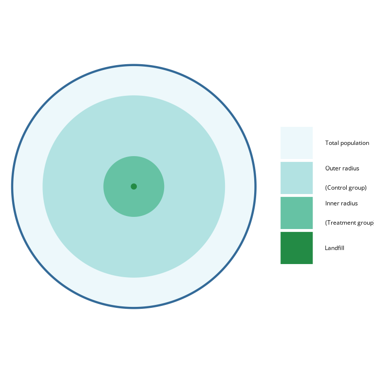

<!-- badges: start -->

<!-- badges: end -->

# donutsR

A set of R functions that complement my masters thesis.

There, I analyze the effect of landfills on the nearby population.
I vary 2 parameters:

-   *inner radius*\
    defines the dummy variable of interest, *living close to a landfill*. 
-   *outer radius*\
    excludes population that lives too far from any landfill.
    

    
With this package, one can create `donut_list`s: lists of regressions with varying inner and outer radius.
There are also functions to interpret the regressions.

## Installation

Run the following line in `R` to install this package:

`remotes::install_github("sarahzeller/donutsR")`

## Functions

-   `donut_models` creates a `donut_list`. 
-   `plot_significance` plots the summary for one parameter of interest.
-   `donut_summary` outputs a `modelsummary` table, specifically tailored to `donut_models`.

`donut_models` takes a data frame with a distance parameter `dist_km`, which determines the distance to a relevant geometry for all or some rows.
It also takes two distance vectors: for the inner radius (`inner`) and the outer (`outer`).
The function then performs a `feols` regression with clustered standard errors.
It outputs a `donut_list`, which includes additional list element with the distance parameters.
Additional parameters can be used for the following robustness checks:

-   Landfill-cluster-bootstrapped standard errors for the treatment dummy
-   Conley standard errors for all independent variables
-   Excluding the $n$ largest clusters
-   Excluding observations within $k$ distance-units of the landfills

## Application

An example of where I used this package can be found [here](https://szeller42.github.io/donut_summary/summary-results.html).
It is the online appendix of my masters thesis, where I analyse the impact of landfills on residents.
The analysis, plots and tables are built with this package.
